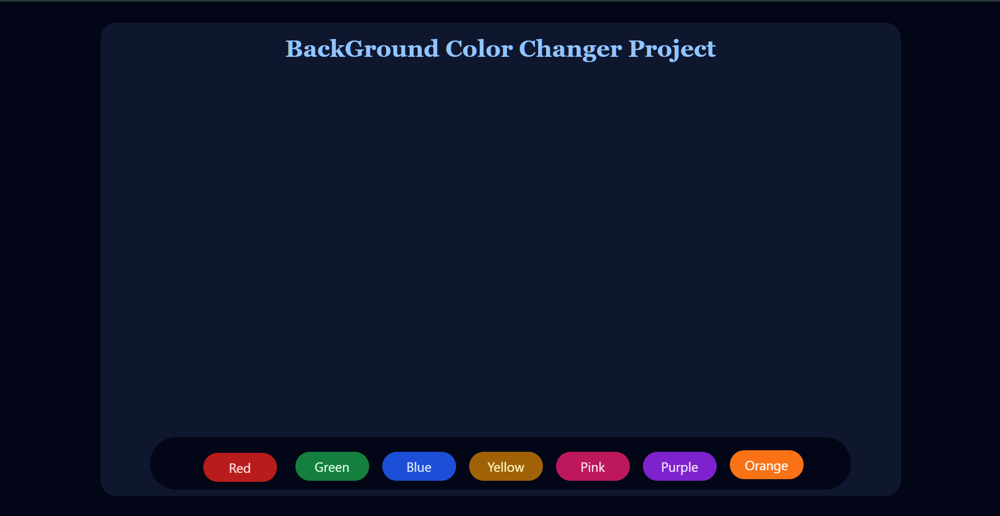

# 🎨 Background Color Changer Project

A fun and interactive React project that allows users to change the background color of a container using styled buttons. Built using React functional components and Tailwind CSS for rapid styling.

---

## 🚀 Features

* Clickable buttons to change background color
* Smooth transitions using Tailwind's utility classes
* Custom component for button controls
* Fully responsive layout with flexible button wrapping

---

## 📸 Screenshot

> Preview of the UI



---

## 🧱 Project Structure

```
📁 src
├── App.js                # Main app container with color logic
├── backGrounColorChanger/
│   └── bgChange.js       # Custom component to render color buttons
├── bg_ss.png             # Screenshot
├── App.css               # Tailwind base and custom styles
└── index.js              # React entry point
```

---

## 🧠 Concepts Used

* `useState()` hook for managing dynamic background color
* Component reusability with props (`changeColor` function passed down)
* Tailwind utility classes for styling and transitions
* Scrollable and responsive button wrapper

---

## 🛠️ Tech Stack

* React (Functional Components)
* Tailwind CSS
* JavaScript (ES6+)

---

## 💻 How to Run Locally

```bash
# 1. Clone the repo
git clone https://github.com/your-username/your-repo-name.git

# 2. Navigate to project folder
cd day-04-react

# 3. Install dependencies
npm install

# 4. Run development server
npm run dev
```

---

## ✨ Future Enhancements

* Add color picker for custom colors
* Show current color code on screen
* Save preferred background to localStorage

---

## 🙌 Author

Made with ❤️ by **Chaitany Mishra**

> "Paint your code with interactivity — one button at a time."
